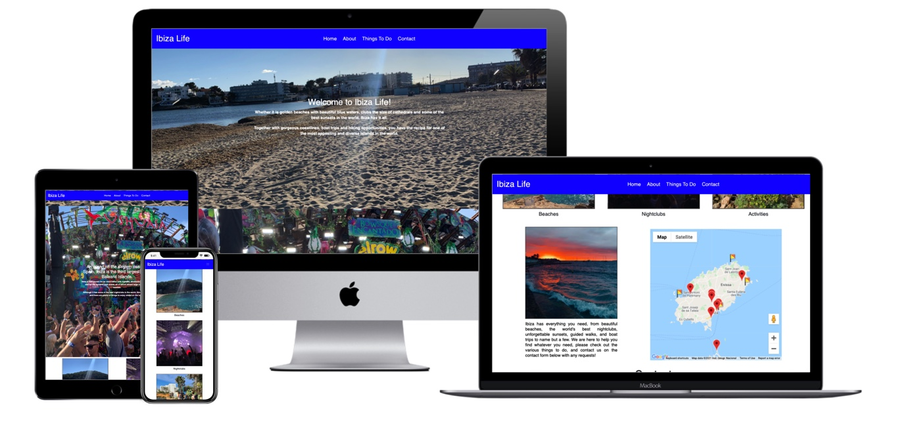
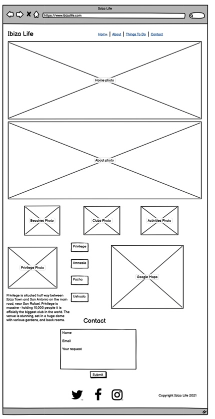
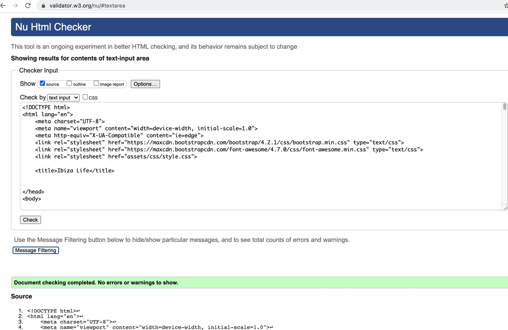
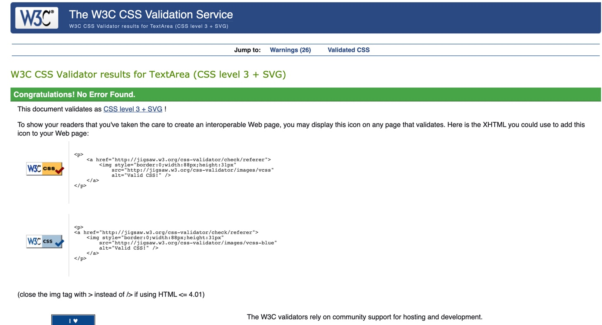
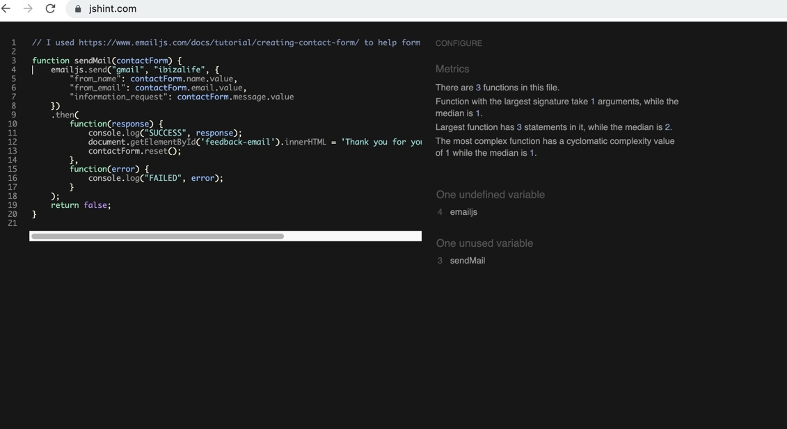
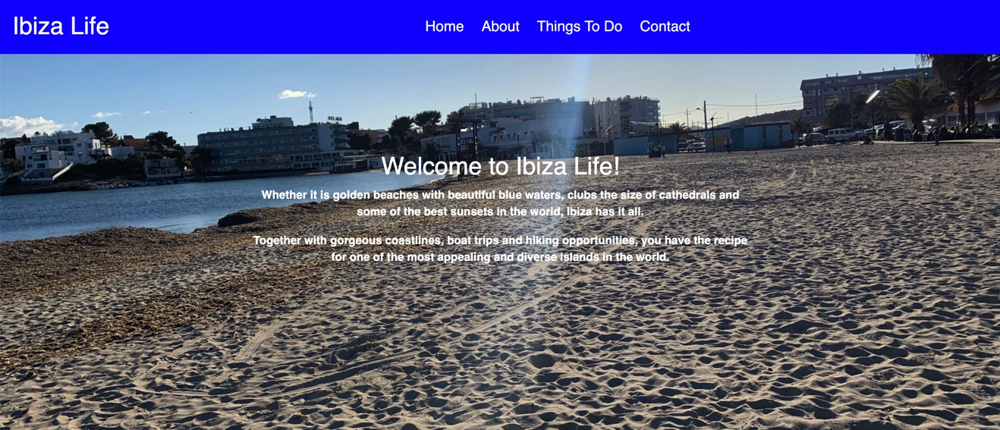
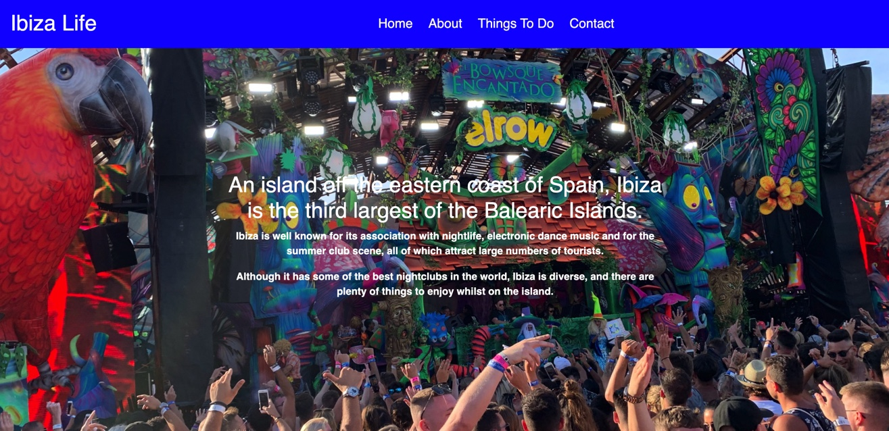
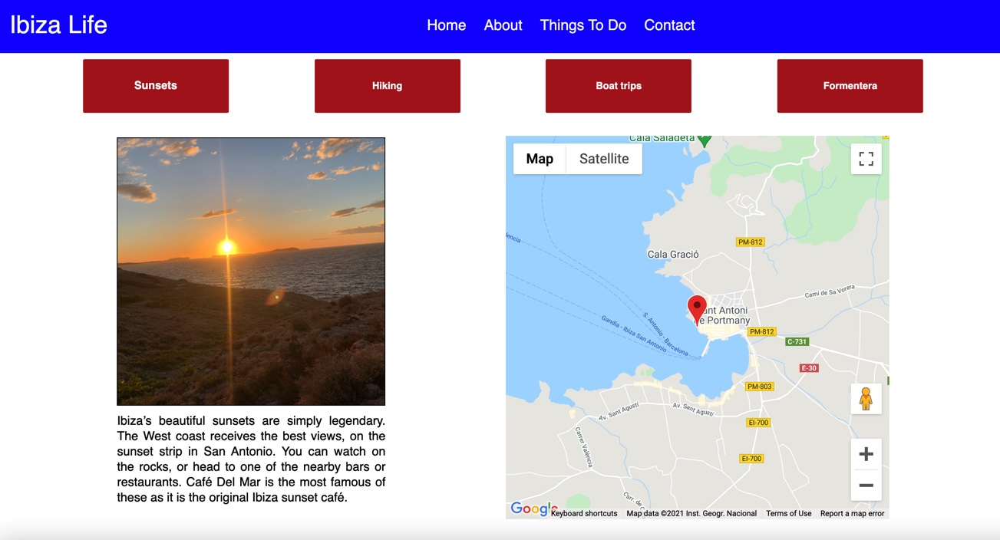
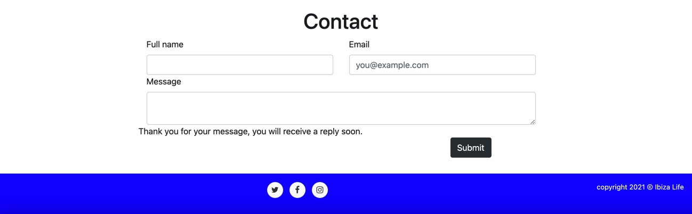

# Ibiza Life

## Milestone Project 2 - Interactive Front-end Development 

Website live link - https://andrewdarwin.github.io/andrewdarwinmsproject2/ 

Github link - https://github.com/AndrewDarwin/andrewdarwinmsproject2 

 

Ibiza Life is an interactive front-end site who’s goal is to introduce the user to the Balearic island of Ibiza, and offers recommendations on various things to do/go such as clubs, beaches and activities like hiking, boat trips and sunsets. The site is designed in HTML and CSS, and through the use of Javascript, the site calls on the Google Maps API to allow users to locate the various places. A contact form allows the user to request more information about any of the places or activities on the site.

# User Experience (UX)

## User stories

* I already know that Ibiza is a tourist destination, but I want to learn more about the island.

* I want to easily navigate through the site and find good content. 

* I want to discover some activities to do on Ibiza

* I want to discover which beaches to visit 

* I know that Ibiza is good for partying, but I want to know which nightclubs are great

* I want to be able to know whereabouts on the island I can do these things. 

* I want to get in touch with Ibiza Life to request more information about booking things like boat trips etc.

## 5 Planes UX

### Strategy

My goal was to develop an appealing travel website that leaves an impression with its users which will mostly be tourists, and those wishing to travel to Ibiza to find great things to do on the island - to inspire them with nice images and advice. I aimed to have a nice layout and clean design - consistent in style and colour throughout. I also wanted the user to find accurate information on different subjects, and a contact form to request more information if needed. The site is designed to respond to the users' actions, allowing users to actively engage with data (specifically, in the Things To Do section), altering the way the site displays the information to achieve their preferred goals.

### Scope

Ibiza Life is contained in a single page for ease of use. The website has a Google Maps API to provide direction to the various places listed in the Things To Do section. The website has a contact form to request more information, and links in the footer to social media pages. 

### Structure

I structured the layout and content in an easily readable way for the user - firstly with a main navigation menu, followed by an introduction to Ibiza - written content provided on top of a hero image. Next, the about section provides more information about Ibiza alongside an image of a beach club, and the various opportunities on the island for tourists, which leads nicely to the Things to Do section, where interactive buttons and Google Maps provide more specific information and locations. Each following section adds to the information on the previous. Next, there is a contact form that the users can send a message requesting more information if needed. 

### Skeleton

Here below is a wireframe of the desktop version of Ibiza Life site

 

### Surface

As the website is based on a summer destination, I chose a nice and bright header and nav with the colour blue - which represents the blue skies and waters of Ibiza. This is the same for the footer also. The colours are kept in harmony with the images - the hero images of the home and about sections are that of a nice beach, and a beach club with lots of colour and people enjoying themselves. Non-text elements have alt text attributes (or the equivalent (eg role=“img” aria-label=“”) to cater for the visually impaired. I chose Spectral as it offers a beautiful font, and believe it fits nicely with the site. 

## Features

The site features a responsive navigation menu, and a footer with social media icons. The site follows the principles of UX design and presents a structured layout and navigation model. The site is a single scrolling page, with 4 separate page areas, as described below;

### Home

Home features a hero image of a beach on a warm, sunny day. As well as the image there is some introductory information about Ibiza. 

### About

About features a hero image of the beach club Ushuaïa, and more information about Ibiza, which leads nicely to the next section, Things To Do. 

### Things To Do

The Things to Do section has buttons showing different things to do, and also showing each of their locations on the Google Maps API.

### Contact

Contact contains a contact form, which requests the user’s name and email, and a box to leave a message. The bottom of the form contains a Submit button. When the user submits their details, there’s a message that displays 'Thank you for your message, you will receive a reply soon.' If any information is missing, I have written code that handles empty or invalid input data. For example, if a particular field is missing, a pop up message on screen appears 'please fill in this field'.

### Features to consider implementing in the future

* A partner section with a direct way to book club tickets, excursions, hotel rooms, cars and boat trips etc.

* Sign up for a newsletter with Ibiza Life to get discount vouchers to use in Ibiza. 

## Technologies Used

### Languages Used

* HTML
* CSS
* JavaScript

### Frameworks, Libraries & Programs Used

* Bootstrap (including jQuery) - to assist with the design and responsiveness of the site.

* Font Awesome - for the social media icons in the footer

* Gitpod - for coding and documenting in the terminal descriptive commit messages, and pushing to GitHub.

* GitHub - to store the project after being pushed from Gitpod.

* Balsamiq - to create the wireframes during the design process for README.

* Google Maps JavaScript API - Interative Maps API.

* EmailJS API - Send Emails directly with JavaScript.

* jQuery - JavaScript library.

## Testing

The site was tested across multiple browsers (Google Chrome, Internet Explorer, Microsoft Edge and Safari browsers) and tested on a variety of devices (Desktop, Laptop, iPhone, iPad) to ensure compatibility and responsiveness. Friends reviewed the site to discuss any user experience issues.

I used W3C Markup Validator, W3C CSS Validator Services and JSHint (direct input on all) to validate the code to ensure there were no errors in the project. They all passed without any errors, screenshots below;

 

 

 

### Testing User Stories from User Experience (UX) Section

* I already know that Ibiza is a tourist destination, but I want to learn more about the island.

The home and about section give an introduction of Ibiza to the user, painting the picture of an idyllic Mediterranean island, whilst the beautiful photos of the island whet the user’s appetite for the next Section - Things To Do. 

* I want to easily navigate through the site and find good content. 

The site has been designed to be fluid and easy to navigate. At the top there is a clean navigation bar, each link describes what section of the site they will end up at clearly. On the Contact, after a form response is submitted, the page displays a message 'Thank you for your message, you will receive a reply soon.'

* I want to discover some things to do on Ibiza

The Things to Do section has several different activities for the user to do on the Island. This page responds to the users' actions, allowing them to engage with data, and altering the way the site displays the information to achieve their preferred goals - for example if the user clicks on either of the “nightclubs”, “beaches” or “activities” they are presented with 4 different choices of each. Users are able to interact with the site in their particular way, to achieve their personal goals and derive answers to their specific questions. This is front-end interactivity. For example, a user wanting to know the best beaches to go to can click on the beaches button in the Things To Do Section, and then choose a particular beach, with a photo and information about the beach, plus a location on the interactive google map alongside. The same can be true for users wanting to know which nightclubs and activities to go on the island.

* I want to discover which beaches to visit 

There are a choice of 4 different beaches to choose from, on different parts of the island, in the Things To Do Section.

* I know that Ibiza is good for partying, but I want to know which nightclubs are great

There are a choice of 4 of the best nightclubs on the island in the Things To Do section.

* I want to be able to know whereabouts on the island I can do these things. 

Google Maps API is embed on the site to allow users to locate the various clubs, beaches and activities in the Things To Do section. 

* I want to get in touch with Ibiza Life for more information about booking things like boat trips etc. 

There is a contact form for the user to get in touch for more information.

## Deployment

The project was deployed to GitHub Pages using the following steps:

1. Log in to GitHub and locate the GitHub Repository

https://github.com/AndrewDarwin/andrewdarwinmsproject2

2. At the top of the Repository, locate the "Settings" button on the menu.

3. Scroll down the Settings page until you locate the "GitHub Pages" Section.

4. Under "Source", click the dropdown called "None" and select "Master Branch".

5. The page will automatically refresh.

6. Scroll back down through the page to locate the new published site link in the "Github Pages" section.

https://andrewdarwin.github.io/andrewdarwinmsproject2/ 

To run locally, you can clone this repository directly into the editor of your choice by pasting git clone https://github.com/AndrewDarwin/andrewdarwinmsproject2 into your terminal. To cut ties with this GitHub repository, type git remote rm origin into the terminal.

## Credits

### Code

* The site was built using Bootstrap. I used Bootstrap documentation to help me construct various parts of my code;

https://getbootstrap.com/docs/4.0/components/navbar/

https://getbootstrap.com/docs/4.3/layout/grid/

https://getbootstrap.com/docs/5.0/forms/layout/

I also used some other bootstrap related sites to aid me with my code;

https://stackoverflow.com/questions/19733447/bootstrap-navbar-with-left-center-or-right-aligned-items

https://stackoverflow.com/questions/41513463/bootstrap-4-align-navbar-items-to-the-right

https://mdbootstrap.com/docs/b4/jquery/navigation/navs/

https://mdbootstrap.com/docs/standard/navigation/footer/

I used https://www.w3schools.com/css/css3_colors.asp for CSS color code

I also used Code Institute course material to assist me in writing code

I was inspired by, and used https://henriqueperoni.github.io/CI-MS2-Magic-Island/ Things To Do Section to assist me in creating the code in the Things To Do Section of the site. 

### Content

All content was written by myself, except for 1 sentence in the About section, taken from the Ibiza wikipedia page - “An island off the eastern coast of Spain, Ibiza is the third largest of the Balearic Islands.”

### Media

* I own all photos

* I used https://techsini.com/multi-mockup/ for the site mockup at the top of README.

### Acknowledgements

Thanks to my Mentor Antonio for continuous helpful feedback.